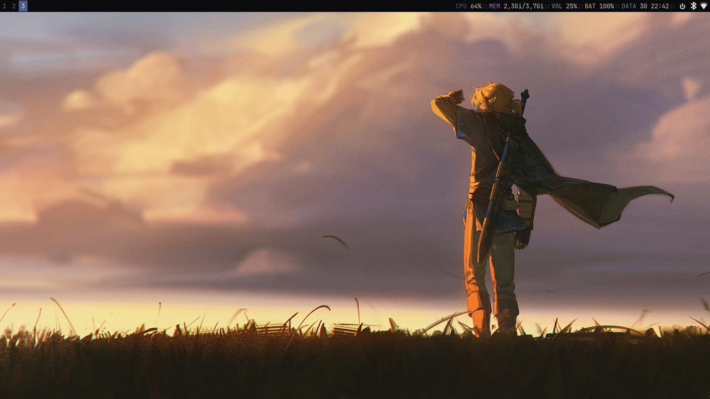
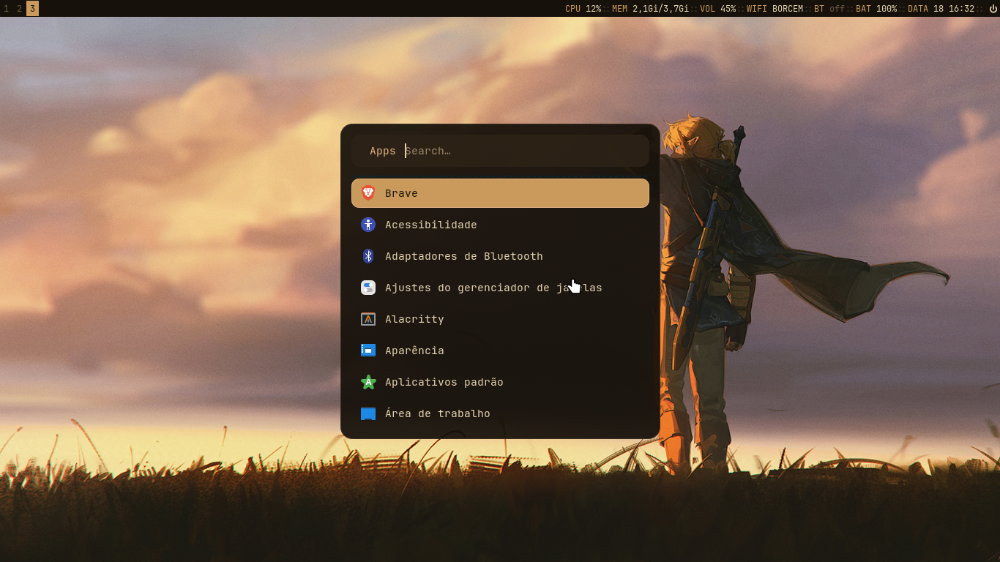
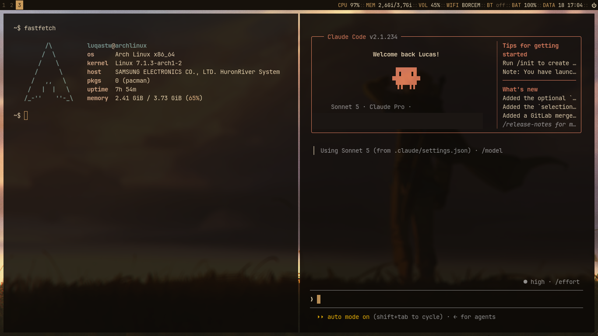

# dotfilestw 🌇





My personal Arch Linux rice: i3wm + Alacritty + picom + dunst, tied together with
[herdr](https://herdr.dev) as a terminal workspace manager instead of tmux.

## ✨ Features

- **Status bar** (i3blocks) with live CPU, memory, volume, wifi, bluetooth, battery
  and clock, plus a click-to-open power menu — see [Status Bar](#-status-bar).
- **Dropdown + pool scratchpad**: one dedicated Alacritty terminal that toggles
  in/out with a single keybind (pre-spawned at i3 startup so the first toggle is
  instant), plus a general scratchpad pool for stashing any other window.
- **Wifi/Bluetooth from the bar**: left-click toggles radio/power, right-click opens
  `nmtui` / `blueman-manager` for full management — no separate applet needed.
- **Auto screen lock**: `xss-lock` + `betterlockscreen` lock the session automatically
  before suspend, not just on manual trigger.
- **Idle cursor hiding** via `unclutter` (3s timeout) and an **input method** ready
  via `fcitx`.
- **Multiple bundled Alacritty themes** under `alacritty/themes/` (Tokyo Night plus
  several wallhaven-derived palettes) — swap by editing the `import` line in
  `alacritty.toml`.
- Custom **rofi** launcher and **dunst** notification theme, both matching the same
  warm copper/amber palette as the bar and window borders.
- Per-app **window rules**: pavucontrol/nitrogen/popups/dialogs float automatically —
  see [Window Rules](#-window-rules).

## Installation

### ⚠️ Requirements ⚠️

**Arch Linux** with **Xorg** and **i3wm** installed.

### Steps

1. Install git:

    ```bash
    sudo pacman -S git
    ```

2. Clone the repository:

    ```bash
    cd $HOME
    git clone --depth 1 https://github.com/luqastw/dotfilestw
    cd dotfilestw
    ```

3. Run the installer:

    ```bash
    ./arch-install.sh
    ```

    It checks your system first (distro, sudo, network, disk space, which
    dependencies/configs are already in place) and prints a report before
    touching anything. If something's missing it shows a plan and asks once
    before installing the pacman + AUR dependencies, herdr, and symlinking
    every config folder into `~/.config` (backing up anything already there).
    Re-running it is safe — it reports "already installed" and exits without
    changes. Useful flags:

    ```bash
    ./arch-install.sh --check      # report only, never mutates
    ./arch-install.sh --deps-only  # dependencies only
    ./arch-install.sh --skip-deps  # symlink configs only
    ./arch-install.sh --force      # re-link configs even if already linked
    ./arch-install.sh --help       # usage
    ```

    Every run appends to `.install.log` in the repo root (gitignored) — handy to
    attach when filing an issue.

---

For additional details or troubleshooting, visit the [issues page](https://github.com/luqastw/dotfilestw/issues).

---

## Keybinds

### ⚡ Launch Applications

| Action              | Keybind             | Description                    |
|----------------------|----------------------|---------------------------------|
| Terminal             | `SUPER + RETURN`     | Launch Alacritty                |
| App Launcher         | `SUPER + D`          | Launch rofi (`drun`)            |

---

### 🧰 System Scripts

| Action                    | Keybind                  | Description                          |
|----------------------------|----------------------------|----------------------------------------|
| Screenshot (full, clipboard) | `SUPER + F11`            | Copy full screenshot via maim + xclip, notify-send confirms |
| Screenshot (select, clipboard) | `SUPER + SHIFT + F11`  | Copy selected-area screenshot         |
| Screenshot (scrot)         | `SUPER + Z` then `S`      | Enter special mode, take scrot -s     |
| Toggle Scratchpad Terminal  | `SUPER + minus`          | Show/hide dropdown Alacritty (auto-spawns) |
| Stash Window to Scratchpad  | `SUPER + SHIFT + minus`  | Move focused window to the general scratchpad pool |
| Cycle Scratchpad Pool       | `SUPER + equal`          | Show next stashed scratchpad window |
| Volume Up/Down/Mute        | `XF86AudioRaiseVolume` / `LowerVolume` / `Mute` | Adjusts volume via pactl, refreshes the VOL block |

---

### 📊 Status Bar

The i3blocks bar (top of screen) reads left to right. WIFI, BT and Power respond to
clicks; the rest are display-only.

| Block   | Shows                        | Click                                                    |
|---------|-------------------------------|-----------------------------------------------------------|
| CPU     | Usage %                       | —                                                           |
| MEM     | Used/total RAM                | —                                                           |
| VOL     | Volume %                      | — (see Volume keybind above)                                |
| WIFI    | SSID, or `off` when radio's down | Left: toggle radio · Right: open `nmtui`                 |
| BT      | Connected device, or `on`/`off` | Left: toggle power · Right: open `blueman-manager`         |
| BAT     | Battery %                     | —                                                           |
| Clock   | `DD HH:MM`                    | —                                                           |
| Power   | —                              | Opens a rofi menu: Lock / Exit / Suspend / Reboot / Shutdown |

---

### 🪟 Window Actions

| Action           | Keybind                | Description                        |
|-------------------|--------------------------|--------------------------------------|
| Kill Window       | `SUPER + C`              | Close the focused window            |
| Toggle Floating   | `SUPER + SHIFT + SPACE`  | Toggle floating for active window   |
| Toggle Focus Mode | `SUPER + SPACE`          | Toggle focus between tiling/floating|
| Fullscreen        | `SUPER + F`              | Toggle fullscreen mode              |
| Focus Parent      | `SUPER + A`              | Focus the parent container          |
| Stacking Layout   | `SUPER + S`              | Set stacking layout                 |
| Tabbed Layout     | `SUPER + W`              | Set tabbed layout                   |
| Toggle Split      | `SUPER + E`              | Toggle split orientation            |
| Split Vertical    | `SUPER + V`              | Split container vertically          |
| Split Horizontal  | `SUPER + SHIFT + V`      | Split container horizontally        |

---

### 📌 Window Focus

Use `SUPER + [key]` to change focus between windows (HJKL navigation):

| Direction | Keybind       |
|-----------|---------------|
| Left      | `SUPER + H`   |
| Right     | `SUPER + L`   |
| Up        | `SUPER + K`   |
| Down      | `SUPER + J`   |

---

### 🪟 Move Window

Use `SUPER + SHIFT + [key]` to move the focused window:

| Direction | Keybind             |
|-----------|----------------------|
| Left      | `SUPER + SHIFT + H`  |
| Right     | `SUPER + SHIFT + L`  |
| Up        | `SUPER + SHIFT + K`  |
| Down      | `SUPER + SHIFT + J`  |

---

### 📏 Resize Mode

Press `SUPER + R` to enter resize mode, then:

| Direction    | Keybind |
|---------------|---------|
| Shrink width  | `L`     |
| Expand width  | `H`     |
| Grow height   | `K`     |
| Shrink height | `J`     |

Exit with `Enter`, `Escape`, or `SUPER + R`.

---

### 🔢 Workspaces

| Action                       | Keybind                                  |
|-------------------------------|--------------------------------------------|
| Switch to workspace 1-10      | `SUPER + Y/U/I/O/P` (1-5), `SUPER + 6-0` (6-10) |
| Move window to workspace 1-10 | `SUPER + SHIFT +` same keys                |

---

### 🌀 i3 Session

| Action        | Keybind             |
|----------------|------------------------|
| Reload config  | `SUPER + SHIFT + C`   |
| Restart i3     | `SUPER + SHIFT + R`   |
| Exit i3        | `SUPER + SHIFT + E`   |

---

### 🧵 herdr

Prefix key is `F12`.

| Action         | Keybind          |
|-----------------|--------------------|
| Toggle sidebar  | `F12` then `P`    |
| Previous tab    | `F12` then `B`    |

---

## 🪟 Window Rules

Defined in `i3/config.d/70-rules.conf`:

| Match                          | Behavior                                              |
|---------------------------------|--------------------------------------------------------|
| `Pavucontrol`                   | Floating                                               |
| `Nitrogen`                      | Floating                                               |
| pop-up windows                  | Floating                                               |
| dialog windows                  | Floating                                               |
| dropdown scratchpad (`scratchterm`) | Floating, 80%×60%, centered, sent to scratchpad    |

Extend it yourself: run `xprop | grep CLASS` on any window and add a `for_window`
rule to that file.

---

## Notes

- `SUPER` is `Mod4` (the Windows/Command key).
- Window focus/movement uses HJKL, VIM-style directional navigation.
- herdr replaces tmux as the terminal multiplexer/workspace manager in this setup.
- The cursor auto-hides after 3s idle (`unclutter`); the session locks
  automatically before suspend (`xss-lock` + `betterlockscreen`), independent of
  the manual Lock action in the power menu.

---

## Details

- OS: **[Arch Linux](https://archlinux.org)**
- WM: **[i3wm](https://github.com/i3/i3)**
- Bar: **[i3blocks](https://github.com/vivien/i3blocks)**
- Terminal: **[Alacritty](https://github.com/alacritty/alacritty)**
- Terminal workspace manager: **[herdr](https://herdr.dev)**
- Compositor: **[picom](https://github.com/yshui/picom)**
- Notifications: **[dunst](https://github.com/dunst-project/dunst)**
- Launcher: **[rofi](https://github.com/davatorium/rofi)**
- Wallpaper: **[nitrogen](https://github.com/l3ib/nitrogen)**
- Lock screen: **[betterlockscreen](https://github.com/pavanjadhaw/betterlockscreen)**
- File manager: **[Thunar](https://gitlab.xfce.org/xfce/thunar)**
- Input method: **[fcitx](https://github.com/fcitx/fcitx)**
- Editor: **[Neovim](https://github.com/neovim/neovim)** ([LazyVim](https://github.com/LazyVim/LazyVim))
- System info: **[fastfetch](https://github.com/fastfetch-cli/fastfetch)**
- Icons/Cursor: **Papirus-Dark** / **Bibata-Modern-Ice**

## Screenshots


